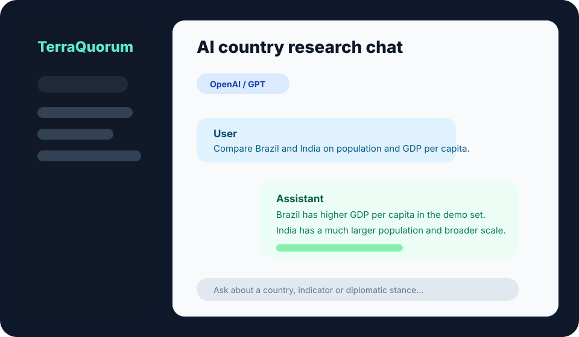
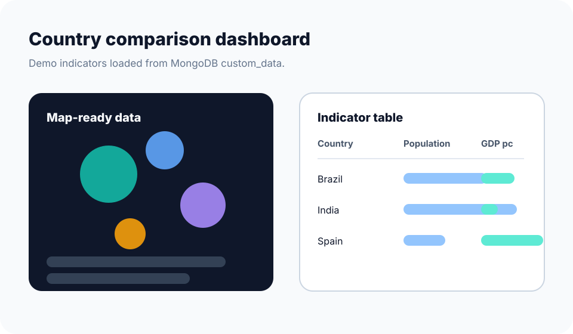
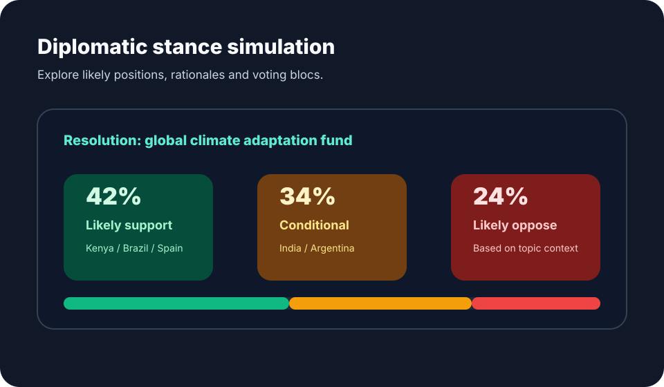
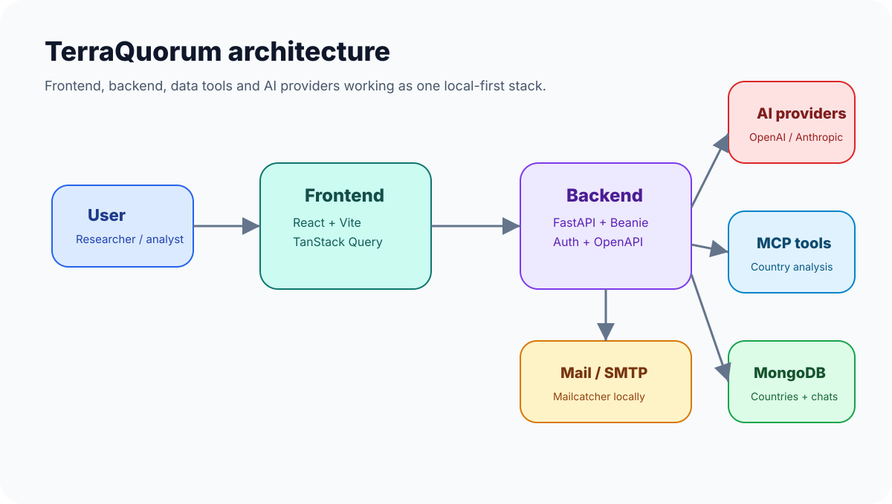

# TerraQuorum

<p align="center">
  
</p>

[](https://github.com/malcovarela00/TerraQuorum/actions/workflows/pre-commit.yml)
[](https://github.com/malcovarela00/TerraQuorum/actions/workflows/test-backend.yml)
[](https://github.com/malcovarela00/TerraQuorum/actions/workflows/playwright.yml)
[](https://github.com/malcovarela00/TerraQuorum/actions/workflows/test-docker-compose.yml)
[](./LICENSE)

TerraQuorum is an open source platform for researching countries, comparing indicators and simulating diplomatic positions with the help of AI.

The goal is to turn public data, assisted search and geopolitical reasoning into an explorable experience: a place where you can ask about a country, compare metrics across regions, save findings and simulate how different states might position themselves on an international proposal.

## Project Status

TerraQuorum is in **alpha**. The full stack foundation is in place, but the project is still being prepared for its first stable public release.

Before running it in production, review in particular:

- the secrets configuration in `.env.example`;
- the exposure of administrative services such as Mongo Express;
- AI provider API keys;
- the deployment workflows if you use your own infrastructure.

## Features

- Analyze country data with AI assistance and public sources.
- Compare countries by economic, demographic and social indicators.
- Save queries and history for traceability.
- Explore stored per-country data from MongoDB.
- Simulate diplomatic positions, allies, rivals and per-country votes.
- Work with multiple model providers: OpenAI, Anthropic, DeepSeek and Google.

## Visual Demo

The repository includes versioned previews of the main flows:

### AI Chat

<p align="center">
  
</p>

### Comparison / map

<p align="center">
  
</p>

### Parliament

<p align="center">
  
</p>

## Architecture



## Stack

- **Frontend:** React 19, TypeScript, Vite, TanStack Router, TanStack Query, Tailwind CSS, Radix UI.
- **Backend:** FastAPI, Pydantic, Beanie, MongoDB, LangChain, FastMCP.
- **AI:** OpenAI, Anthropic, DeepSeek and Google Generative AI.
- **Quality:** Ruff, mypy, Biome, pytest, coverage, Playwright.
- **Infrastructure:** Docker Compose, Traefik, GitHub Actions, Dependabot, Gitleaks.

## Quickstart

Requirements:

- Docker Engine or Docker Desktop;
- [Bun](https://bun.sh/) for local frontend development;
- [uv](https://docs.astral.sh/uv/) for local backend development.

Full stack with Docker Compose:

```bash
cp .env.example .env
cp frontend/.env.example frontend/.env
docker compose watch
```

In another terminal, load the offline demo data:

```bash
./scripts/seed-demo.sh
```

Common URLs:

- Frontend: <http://localhost:5173>
- Backend: <http://localhost:8000>
- Swagger: <http://localhost:8000/docs>
- Mongo Express: <http://localhost:8081>
- Mailcatcher: <http://localhost:1080>

To use the AI features, configure at least one key in `.env`:

```dotenv
OPENAI_API_KEY=
ANTHROPIC_API_KEY=
DEEPSEEK_API_KEY=
GOOGLE_API_KEY=
```

Without those keys you can still start the stack, log into the application, browse Swagger, manage users and explore the demo data loaded into MongoDB. Model responses and transcriptions require configuring the corresponding provider.

## Development

Local frontend:

```bash
bun install
bun run dev
```

Local backend:

```bash
cd backend
uv sync
source .venv/bin/activate
fastapi dev app/main.py
```

Main test suites:

```bash
cd backend
uv run bash scripts/tests-start.sh
```

```bash
cd frontend
bunx playwright test
```

## Deployment

The short version — the full guide lives in [deployment.md](./deployment.md):

1. Provision a server with Docker Engine and point your DNS (including a wildcard such as `*.yourdomain.com`) to it.
2. Start the shared Traefik proxy once with [compose.traefik.yml](./compose.traefik.yml) and create the `traefik-public` Docker network.
3. Copy the repository to the server, create a production `.env` with strong secrets (never reuse the example placeholders) and run:

```bash
docker compose -f compose.yml build
docker compose -f compose.yml up -d
```

The stack serves the API at `api.${DOMAIN}`, the frontend at `dashboard.${DOMAIN}` and Mongo Express at `mongo.${DOMAIN}` with automatic HTTPS via Let's Encrypt. Optional GitHub Actions deploy workflows for self-hosted runners are included but disabled by default.

## Documentation

- [Development guide](./development.md)
- [Deployment guide](./deployment.md)
- [Backend](./backend/README.md)
- [Frontend](./frontend/README.md)
- [Security](./SECURITY.md)
- [Local demo](./docs/LOCAL_DEMO.md)
- [Quality and verification](./docs/QUALITY.md)
- [Contributing](./CONTRIBUTING.md)
- [Code of conduct](./CODE_OF_CONDUCT.md)
- [Suggested initial issues](./docs/INITIAL_ISSUES.md)
- [Changelog](./CHANGELOG.md)
- [Release v0.1.0](./docs/RELEASE_V0.1.0.md)

## Roadmap

- Publish a first demo with seed data.
- Improve per-country comparative visualizations.
- Add reproducible geopolitical analysis templates.
- Split public CI from private deployment workflows.
- Strengthen the parliamentary simulation and voting module.
- Expand indicator coverage and verifiable sources.

## Contributing

Contributions are welcome. Check [CONTRIBUTING.md](./CONTRIBUTING.md), open small, focused issues and never include credentials, data dumps or sensitive information.

## License

This project is distributed under the MIT license. See [LICENSE](./LICENSE).
# terraquorum
# TerraQuorum
